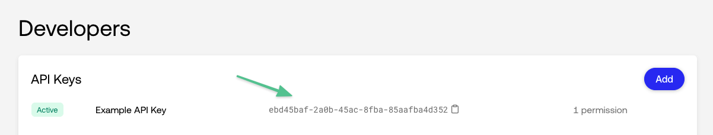

<h1 align="center"> Example Web Checkout</h1>

<h3 align="center">

Example integration of Universal Checkout using the [Primer Web SDK](https://primer.io)

</h3>

<h4 align="center">

This is a companion project to the [Web Getting Start Guide](https://primer.io/docs/get-started/web).

</h4>

<br />

## ✅ Pre-requisites

- **A Primer sandbox account** 🚀

- **A handful of programs installed on your machine** <br /> `node`, and `yarn` or `npm`, that's it! 💪

- **5 minutes of your time** <br /> Then you can show your colleagues how powerful Universal Checkout is 😎

## 🚀 Get Started

### 👨‍💻 Installation

Clone this repository:

```bash
git clone https://github.com/primer-io/example-web-checkout.git
cd ./example-web-checkout
```

Then install the dependencies using `yarn` or `npm`:

```bash
# With yarn
yarn
```

```bash
# With npm
npm i
```

### 🔑 Set up the API Key

Grab your API Key, or create a new one, from the [Primer Dashboard](https://sandbox-dashboard.primer.io/developers/apiKeys).



Copy `env.example` and name the file `.env`.

```
cp env.example .env
```

Open `.env` and set the environment variable `API_KEY` with the API key available on your dashboard.

```
# .env
API_KEY=1234-1234-1234-1234 # Your Primer API Key
```

### 🏃‍♂️ Run the server

```bash
# With yarn
yarn start

# With npm
npm start
```

The server is deployed on port `8880` by default. You can change the port by setting the `PORT` environment variable in the `.env` file.

This server uses [`nodemon`](https://www.npmjs.com/package/nodemon) under the hood to automatically re-run the server when a change to the source files or `.env` is made.

### 💳 Access the checkout

Check the checkout at [http://localhost:8880/](http://localhost:8880/).

You should see Universal Checkout appear with the payment methods configured on your [Dashboard](https://dashboard.sandbox.primer.io/checkout)! 🎉


## 👀 What's next?

- ✨ Explore the capabilities of your [Dashboard](https://dashboard.sandbox.primer.io/)
- 📚 Take a look at our [Documentation](https://primer.io/docs) to customize Universal Checkout to better fit your needs
- 📖 Explore our [Web SDK Reference](https://www.npmjs.com/package/@primer-io/checkout-web) and [Server API Reference](https://apiref.primer.io)
- 🎒 Learn more about [how Primer works](https://primer.io/docs/how-primer-works)
- 🤙 Reach out to us at [support@primer.io](mailto:support@primer.io) if you are facing any issues
- 🤘 Join our developer community on [Discord](https://bit.ly/3xBTFl6)
